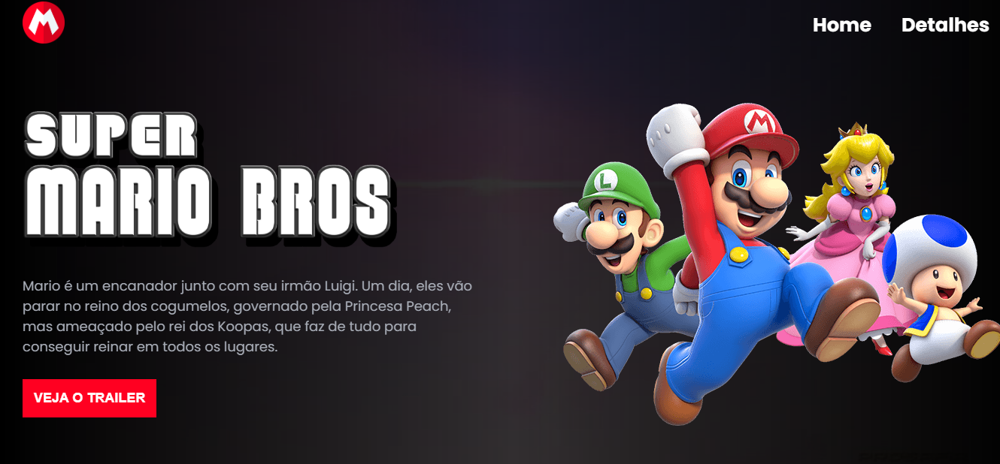

<h1 align="center"> Projeto Mario Bros </h1>

Programa exclusivo e gratuito, promovido pela Dev em dobro para ensino de tecnologias WEB.  
<a href="https://www.youtube.com/c/devemdobro">Estude esse projeto em formato de vídeo clicando aqui.</a>

  <a href="#-tecnologias">Tecnologias</a>&nbsp;&nbsp;&nbsp;|&nbsp;&nbsp;&nbsp;
  <a href="#-projeto">Projeto</a>&nbsp;&nbsp;&nbsp;|&nbsp;&nbsp;&nbsp;
  <a href="#-layout">Layout</a>&nbsp;&nbsp;&nbsp;|&nbsp;&nbsp;&nbsp;
  <a href="#memo-licença">Licença</a>

  

 

  

## 🚀 Tecnologias

Esse projeto foi desenvolvido com as seguintes tecnologias:

- HTML e CSS
- JavaScript
- Git e Github

## 💻 Projeto

O projeto consiste em uma landing page animada.

- [Acesse o projeto finalizado, online](https://julianascimento4.github.io/devemdobro/)

## :memo: Licença

Esse projeto está sob a licença MIT.

---

Feito com ♥ by Dev em dobro
